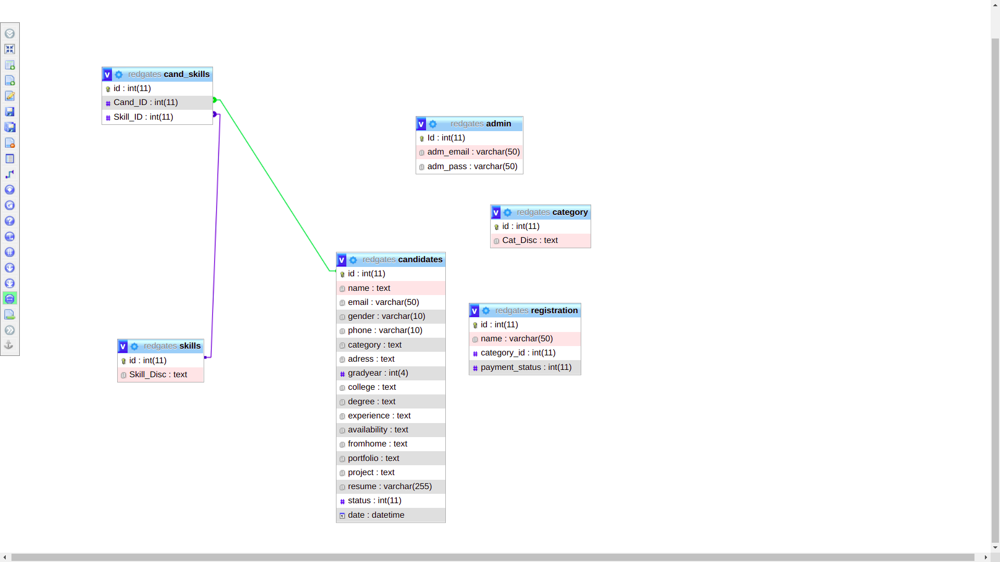
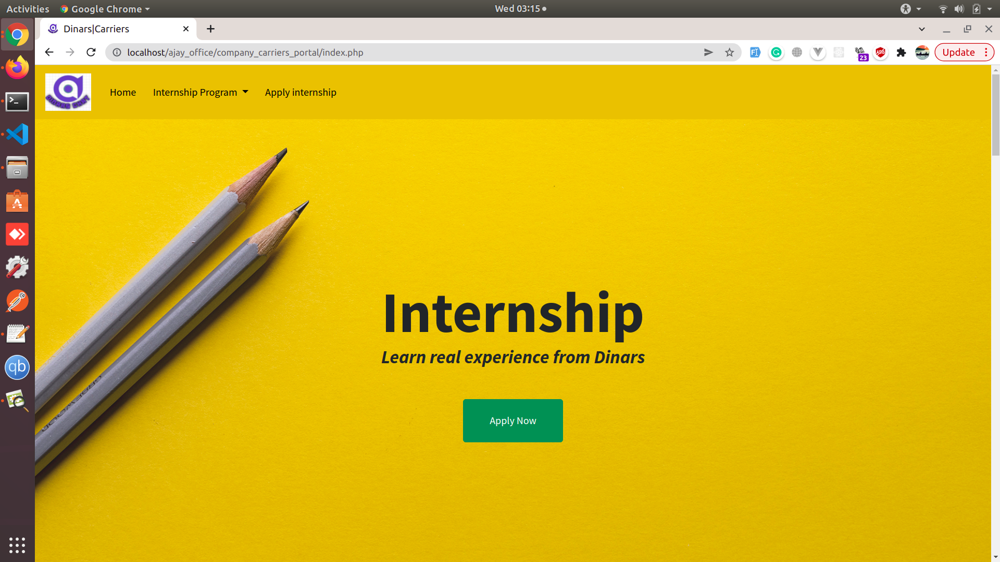
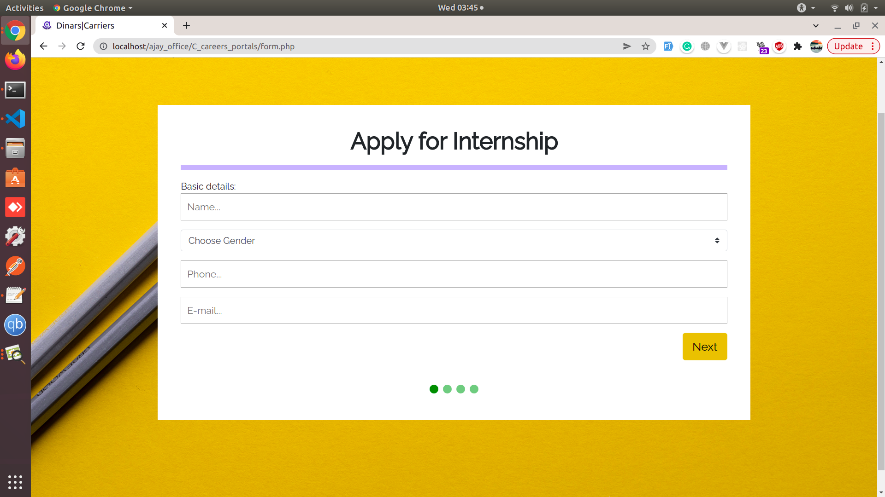
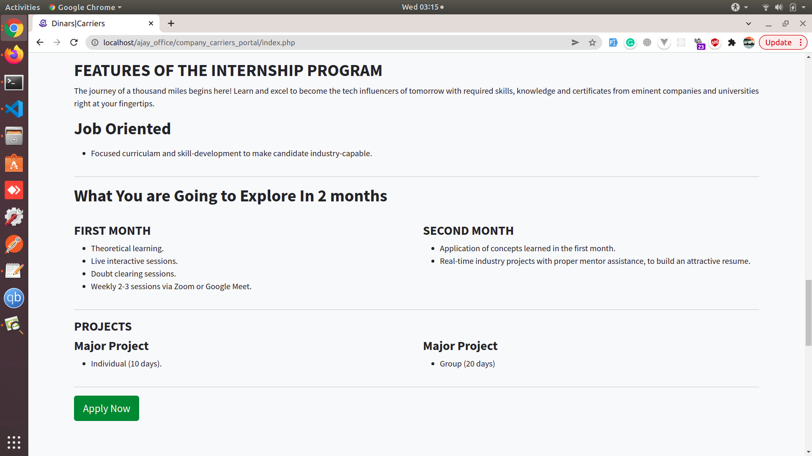
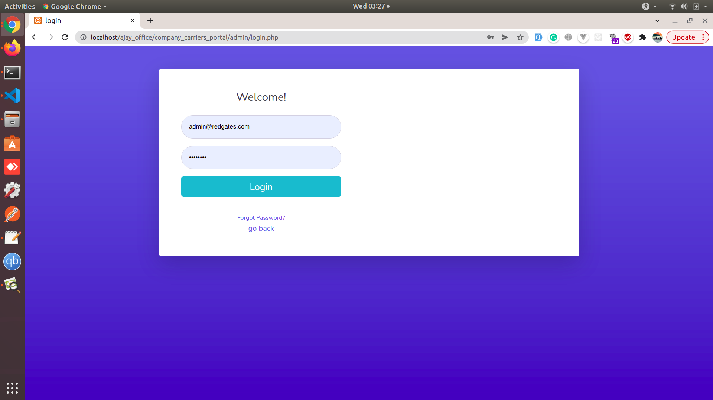
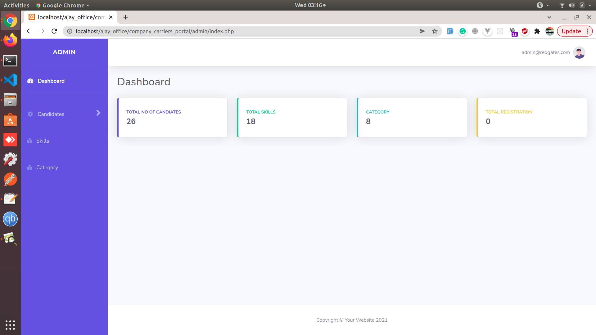
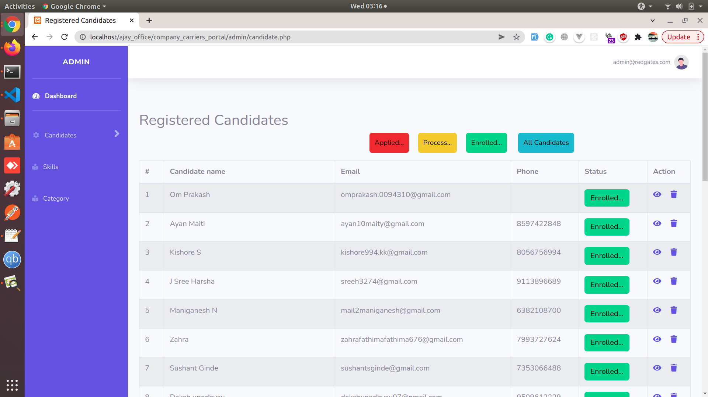
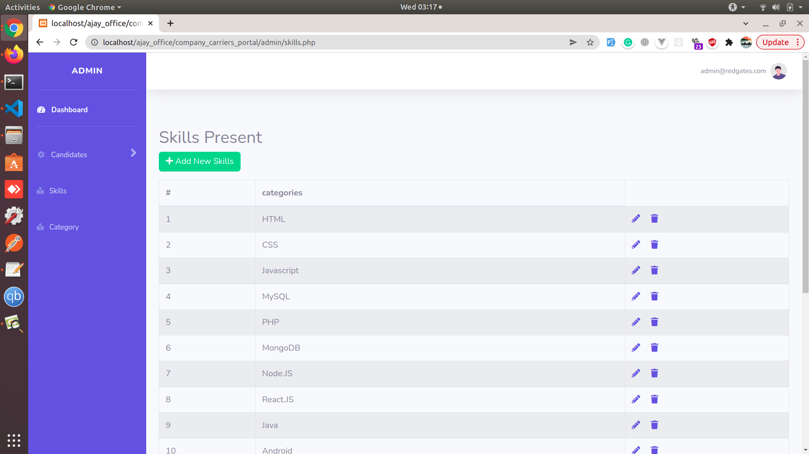
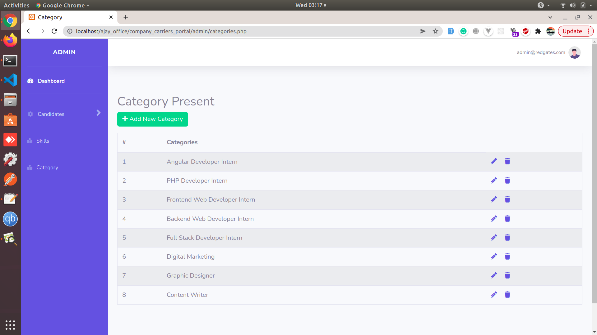
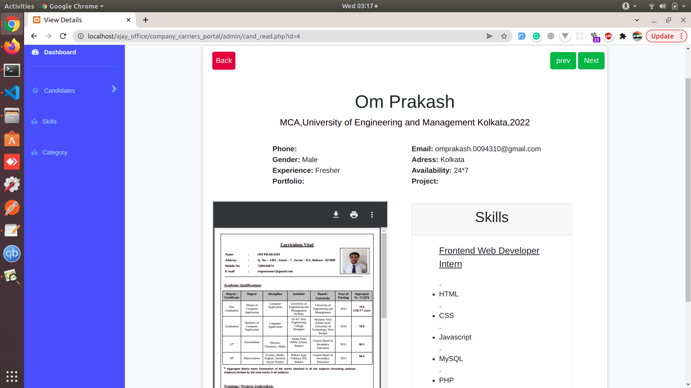

# Objective
The application That I have made Careers Portal. My Objective was To Make This Application Take data from student as job or internship. The Features That I have Give Admin login, To view all the records of the applied internship or job.from user side user can apply as well as we given multiple page about internship or job role for better understanding about role.

# Technologies Used
* Frontend: HTML, CSS, Boostrap 4,javascript,Taildwind css
* Backend: PHP,Mysql,
# DATABASE DESIGN

# snapshots
welcome Page

Register page

About Page

Admin login form

Dashboard page

Candidates List

Sills Add 

Category Add

Resume View page

Resume View page

